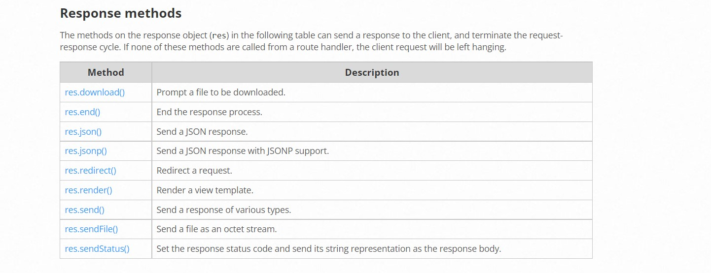

# Reading Day2

## [Home Page](/README.md)

## Express REST API
## ES6 Classes
ES6 classes: are a template for creating objects.

> classes "spoecial functions"

Class declarations using `class`

Class expressions can be named or unnamed.

Constructor : method we use it for creating  and initializing an object created with a `class`.

class members that might be inside class body:

1. Strict mode

2. Constructor

3. Static initialization blocks

4. Prototype methods

5. Generator methods

## Routing

### Route methods

A route method is derived from one of the HTTP methods, and is attached to an instance of the express class.

ex. `GET POST DELETE PUT`

## Route paths

Route paths, in combination with a request method, define the endpoints at which requests can be made. Route paths can be strings, string patterns, or regular expressions

## Route parameters
Route parameters are named URL segments that are used to capture the values specified at their position in the Url.

## Conclusion

- Use `express.Router()` multiple times to define groups of routes
- Apply the `express.Router()` to a section of our site using `app.use()`
-Use route middleware to process requests
- Use route middleware to validate parameters using`.param()`
- Use `app.route()` as a shortcut to the Router to define multiple requests on a route